# OpenVLA Interface Dependencies - Actual External Call Analysis

This document provides an analysis of the **actual external interface requirements** for porting/migrating existing MLLMs into OpenVLA, based on real calls from outside `prismatic/extern/hf/`.

## OpenVLA External Interface Analysis

## Detailed Method Call Dependencies - Implementation Requirements

**Legend**: 🔴 = New Implementation | 🟠 = Wrapper/Extension | ✅ = Already Exists

```mermaid
graph TD
    %% External Files
    A[vla-scripts/finetune.py]
    B[experiments/robot/openvla_utils.py]
    C[vla-scripts/extern/verify_openvla.py]

    %% OpenVLA Classes with Methods
    subgraph "OpenVLAForActionPrediction (modeling_prismatic.py)"
        D[predict_action 🔴]
        E[vision_backbone.set_num_images_in_input 🔴]
        F[from_pretrained ✅]
        G[save_pretrained ✅]
        H[to ✅]
    end

    subgraph "PrismaticProcessor (processing_prismatic.py)"
        I[__call__ 🟠]
        J[decode 🟠]
    end

    subgraph "OpenVLAConfig (configuration_prismatic.py)"
        K[__init__ 🟠]
        L[norm_stats 🔴]
        M[n_action_bins 🔴]
    end

    %% Internal Methods (called by predict_action)
    subgraph "Internal Methods (within modeling_prismatic.py)"
        N[_unnormalize_actions 🔴]
        O[get_action_stats 🔴]
        P[_check_unnorm_key 🔴]
        Q[_predict_actions_from_hidden_states 🔴]
    end

    %% Actual External Calls
    A --> |"vla.vision_backbone.set_num_images_in_input(cfg.num_images_in_input)"| E
    A --> |"processor = AutoProcessor.from_pretrained() -> PrismaticProcessor"| I
    A --> |"vla = AutoModelForVision2Seq.from_pretrained() -> OpenVLAForActionPrediction"| F

    B --> |"vla.vision_backbone.set_num_images_in_input(cfg.num_images_in_input)"| E
    B --> |"vla.predict_action(**inputs, unnorm_key=cfg.unnorm_key)"| D

    C --> |"processor(prompt, image)"| I
    C --> |"processor.decode(gen_ids)"| J
    C --> |"vla.predict_action(**inputs, unnorm_key='bridge_orig')"| D

    %% Internal Dependencies
    D --> |"calls internally"| N
    D --> |"calls internally"| O
    D --> |"calls internally"| P
    D --> |"calls internally"| Q

    F --> |"requires"| K
    D --> |"uses config"| L
    D --> |"uses config"| M

    %% Styling
    classDef external fill:#e3f2fd,stroke:#1565c0,stroke-width:3px
    classDef newImplementation fill:#ffcdd2,stroke:#d32f2f,stroke-width:3px
    classDef alreadyExists fill:#c8e6c9,stroke:#2e7d32,stroke-width:2px
    classDef wrapperNeeded fill:#fff3e0,stroke:#ef6c00,stroke-width:2px
    classDef configExtension fill:#f3e5f5,stroke:#7b1fa2,stroke-width:2px

    class A,B,C external
    class D,E,N,O,P,Q newImplementation
    class F,G,H alreadyExists
    class I,J wrapperNeeded
    class K,L,M configExtension
```

## Summary: Implementation Requirements for InternVL3 Migration

### 🔴 **NEW IMPLEMENTATION NEEDED (6 methods)**
These are OpenVLA-specific methods that don't exist in standard MLLMs:
1. **`predict_action(**inputs, unnorm_key, do_sample=False)`** - **Core method** (90% of work)
2. **`vision_backbone.set_num_images_in_input(num)`** - Multi-image input support
3. **`_unnormalize_actions()`** - Convert normalized to real actions
4. **`get_action_stats()`** - Get normalization statistics
5. **`_check_unnorm_key()`** - Validate unnorm_key
6. **`_predict_actions_from_hidden_states()`** - Core prediction logic

### 🟠 **WRAPPER/EXTENSION NEEDED (5 items)**
These exist in MLLMs but need OpenVLA-specific extensions:
1. **`PrismaticProcessor.__call__(text, images)`** - Wrap InternVL processor
2. **`PrismaticProcessor.decode(token_ids)`** - Wrap InternVL processor
3. **`OpenVLAConfig.__init__()`** - Extend InternVL config
4. **`OpenVLAConfig.norm_stats`** - Add action normalization property
5. **`OpenVLAConfig.n_action_bins`** - Add action discretization property

### ✅ **ALREADY EXISTS (3 methods)**
These are standard HuggingFace/PyTorch methods that InternVL3 already has:
1. **`from_pretrained(model_path, **kwargs)`** - Standard HF loading
2. **`save_pretrained(path)`** - Standard HF saving
3. **`to(device)`** - Standard PyTorch device movement

### 🤗 **HuggingFace Integration (Required)**
- `AutoProcessor.from_pretrained` compatibility (via registration)
- `AutoModelForVision2Seq.from_pretrained` compatibility (via registration)
- `config_class = OpenVLAConfig` attribute

### 💡 **Key Implementation Insights**
1. **Focus on `predict_action()`** - This is 90% of the new implementation work
2. **Most methods already exist** - InternVL3 has standard HF/PyTorch methods
3. **Processor is just wrapping** - InternVL processor just needs OpenVLA interface
4. **Configuration extension** - Add action-specific properties to existing config
5. **Vision backbone extension** - Add multi-image support to existing vision component

### 🚀 **Implementation Priority**
1. **🔴 `predict_action()` method** - Core OpenVLA functionality (highest priority)
2. **🔴 Internal action methods** - `_unnormalize_actions`, `get_action_stats`, etc.
3. **🟠 Processor wrappers** - `__call__` and `decode` methods
4. **🟠 Configuration extension** - Add action-specific properties
5. **🔴 Vision backbone extension** - `set_num_images_in_input` method

**Bottom line**: Only **6 new methods** need implementation, **5 need wrapping/extension**, and **3 already exist**! 🎯
